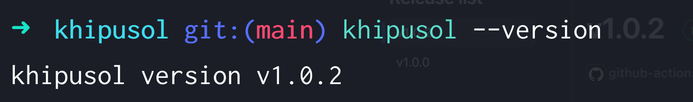
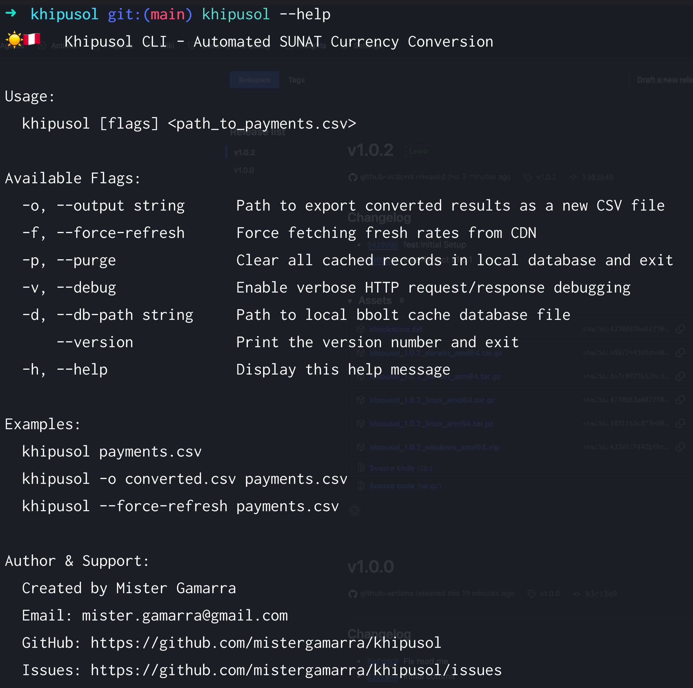

# Khipusol ☀️🇵🇪

[](https://github.com/mistergamarra/khipusol/releases)
[](https://github.com/mistergamarra/khipusol/actions)
[](LICENSE)

**Khipusol** is a lightweight CLI tool built in Go that converts payment amounts using official **SUNAT** exchange rates.

## 📖 Documentation Index
For detailed guides and references, explore the documentation suite:

* **[Architecture](docs/architecture.md)**: Static JSON + CDN + local cache design.
* **[CLI Reference](docs/cli-reference.md)**: Flags and environment variables.
* **[Data Pipeline](docs/data-pipeline.md)**: Generating historical rate files.
* **[Contributing](docs/contributing.md)**: Local dev and test setup.

## 📦 Installation

Choose the installation method that fits your workflow best.

### Option 1: Direct Download (Recommended for End Users)

Download the pre-compiled binary for your operating system directly from the [GitHub Releases](https://github.com/mistergamarra/khipusol/releases) page.

1. Download the archive for your platform (`darwin-arm64`, `linux-amd64`, `windows-amd64`, etc.).
2. Extract the archive.
3. Move the binary into your executable path:

```bash
# macOS / Linux
tar -xzf khipusol_*.tar.gz
sudo mv khipusol /usr/local/bin/
```

### Option 2: Install via Go (***go install***)
If you already have Go installed (v1.26+), you can install Khipusol directly to your ***$GOPATH/bin***:

```bash
go install github.com/mistergamarra/khipusol@latest
```

### Option 3: Build from Source
For developers or contributors who want to compile from the master branch:

```bash
# Clone the repository
git clone https://github.com/mistergamarra/khipusol.git
cd khipusol

# Compile the binary
go build -o khipusol main.go

# Optional: Move to path
sudo mv khipusol /usr/local/bin/
```

### Verify installation:
```bash
# macOS / Linux
khipusol --version
```

```bash
# macOS / Linux
khipusol --help
```

---

## 📜 License

Distributed under the **MIT License**. See the [LICENSE](LICENSE) file for more information.