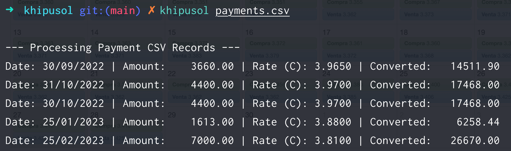
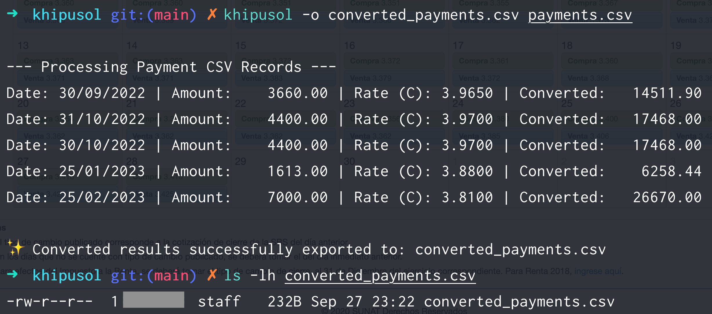

# CLI Reference Manual 🎛️
Khipusol provides a straightforward, flags-driven command-line interface.

## Usage Syntax
```bash
khipusol [flags] <input_csv_file>
```

## Available Flags

| Flag | Shorthand | Description | Default |
| :--- | :---: | :--- | :--- |
| `--output` | `-o` | Export converted results to a specified CSV file path | `""` (Terminal only) |
| `--force-refresh` | `-f` | Bypass local cache and fetch fresh rates from the CDN | `false` |
| `--purge` | `-p` | Clear all cached records in the local bbolt database and exit | `false` |
| `--debug` | `-v` | Enable verbose HTTP request and processing logs | `false` |
| `--db-path` | `-d` | Custom file path for the local bbolt cache database | OS Native Cache Directory |

## Environment Variables

You can configure Khipusol defaults using a **.env** file in your execution directory:

* **RATES_REPO_URL** : Custom base URL for static JSON rates (defaults to JSDelivr CDN).

* **CACHE_TTL_DAYS**: Number of days before cached monthly rates expire (default: 30).

* **DEBUG**: Set to true to enable verbose logging by default.

## Usage Examples

### 1. Basic Execution (Terminal Output)
Process a payment file and display the converted results directly in the terminal:

```bash
khipusol payments.csv
```


### 2. Export Converted Results to CSV
Save the output containing exchange rates and converted PEN amounts into a new CSV file:

```bash
khipusol -o converted_payments.csv payments.csv
```


### 3. Force Cache Refresh
Bypass the local bbolt database and re-fetch rate data directly from the CDN:

```bash
khipusol --force-refresh payments.csv
# or using shorthand
khipusol -f payments.csv
```

### 4. Enable Debug Mode
Print detailed HTTP request logs, CDN URLs, and internal processing steps:

```bash
khipusol -v payments.csv
```

### 5. Custom Database Cache Location
Specify a custom path for the local bbolt cache database instead of using the OS default:

```bash
khipusol -d ./data/cache.db payments.csv
```

### 6. Purge Local Database Cache
Delete all stored exchange rate records from the local cache and terminate:

```bash
khipusol --purge
```

### 7. Combining Multiple Flags
Run with verbose logs, force fresh CDN fetches, and export the output to a file:

```bash
khipusol -v -f -o output.csv input_payments.csv
```

