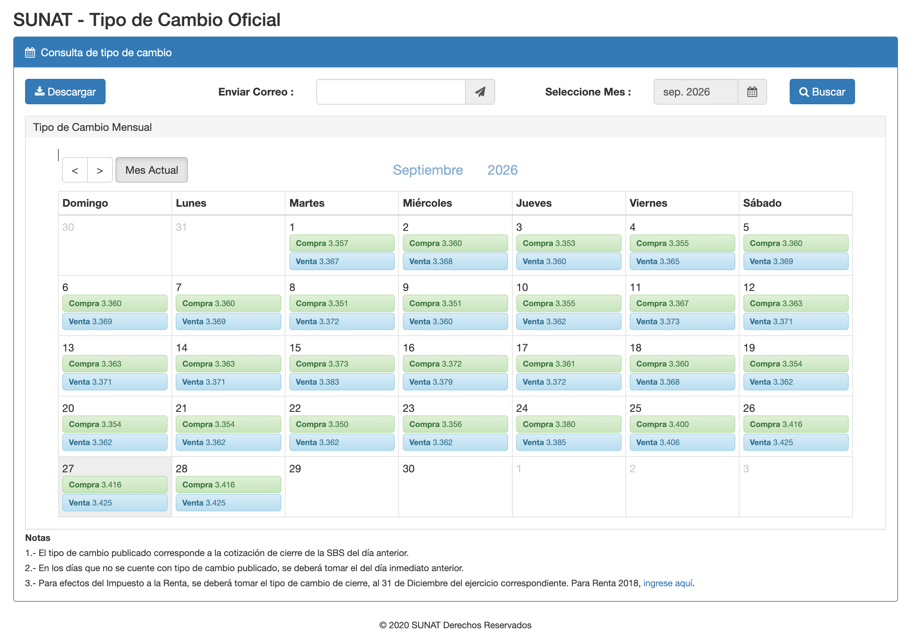

# Data Pipeline & Rate Generation 📊

SUNAT exchange rates are immutable historical records. To avoid brittle browser/token-based API scraping at runtime, Khipusol uses a static JSON data pipeline hosted on GitHub.

## Official Data Source: SUNAT

All exchange rates used by Khipusol originate from the official Peruvian tax authority portal:
* **Official Website / API Endpoint:** [SUNAT Tipo de Cambio Portal](https://e-consulta.sunat.gob.pe/cl-at-ittipcam/tcS01Alias)



### How Data Flows from SUNAT to the CLI
1. **Upstream Source:** The official SUNAT portal provides daily official exchange rates (Compra / Venta).
2. **Data Generation (`scripts/generate_rates.sh`):** Maintainers run the generation script, which securely queries the SUNAT endpoint (`tcS01Alias/listarTipoCambio`) to compile monthly JSON files (`rates/YYYY/MM.json`).
3. **CDN Distribution:** Once pushed to GitHub, these files are instantly available globally via the JSDelivr CDN (`https://cdn.jsdelivr.net/gh/mistergamarra/khipusol@main/rates`).
4. **Runtime CLI Execution:** End-user installations of Khipusol fetch these static files and cache them locally using `bbolt`, ensuring zero government API downtime, zero token expiration issues, and lightning-fast payment processing.

## Folder Structure (***rates/***)
Historical rates are organized by year and month inside the repository:

```bash
rates/
├── 2020/
│   ├── 01.json
│   └── ...
└── 2023/
    ├── 01.json
    ├── 02.json
    └── ...
```

## Generating Rates (***scripts/generate_rates.sh***)
If you need to update or generate historical data blocks, use the automated shell script:

1. Configure your SUNAT session token in your .env file:

```
TOKEN="your_sunat_session_token"
API_URL="[https://e-consulta.sunat.gob.pe/cl-at-ittipcam/tcS01Alias/listarTipoCambio](https://e-consulta.sunat.gob.pe/cl-at-ittipcam/tcS01Alias/listarTipoCambio)"
```

2. Run the script (it utilizes SUNAT's 0-indexed month system where 0 = January and 11 = December, and automatically skips existing files):

```
chmod +x scripts/generate_rates.sh
./scripts/generate_rates.sh
```

3. Commit and push changes to update the public CDN repository.

